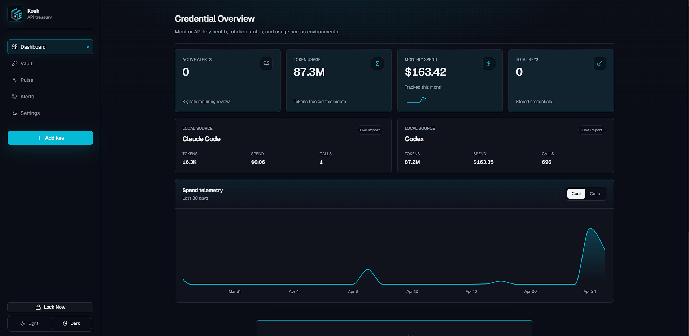

# Kosh

Local-first API key treasury and AI usage monitor for developers.

Kosh stores API keys locally, encrypts secrets at rest, tracks provider usage where APIs allow it, and imports local Codex and Claude Code usage without storing prompts or responses.



## What Kosh Does

- Encrypted API key vault with platform, environment, notes, rotation metadata, and copy/reveal controls.
- Usage dashboard for cost, calls, and token trends across API keys and local AI tools.
- Local Codex and Claude Code imports from JSONL usage metadata.
- Codex rate limit snapshots from local auth or CLI status, shown separately from estimated spend.
- Connector capability model so each provider clearly reports whether validation, sync, billing, or manual entry is supported.
- Alerts for cost, calls, and token thresholds across API keys or local AI usage sources.
- Pulse view for day-to-day usage and spend scanning.
- Export/import backup flow for vault metadata and usage history.
- Auto-lock, light/dark/system appearance, and a setup screen for local bootstrap.

## Data Model

Kosh separates three kinds of telemetry:

- API key records: encrypted credentials, metadata, rotation state, and provider validation status.
- Usage history: `UsageEvent` and `UsageDailyRollup` records for cost, calls, and tokens.
- Quota snapshots: `UsageQuotaSnapshot` records for live Codex rate-limit windows.

Local Codex and Claude Code imports store token and cost metadata only. Kosh does not store prompts, responses, or transcript content.

## Tech Stack

- Next.js 16 App Router
- React 19
- Prisma 5 with SQLite
- Tailwind CSS and shadcn-style components
- Recharts
- Lucide React
- crypto-js AES encryption

## Getting Started

### Prerequisites

- Node.js 20+
- npm

### Local Development

1. Install dependencies.

```bash
npm install
```

2. Bootstrap the local install.

```bash
npm run bootstrap
```

3. Start the app.

```bash
npm run dev
```

Open [http://localhost:3000](http://localhost:3000).

## Docker

```bash
docker compose up --build -d
```

For plain Docker:

```bash
docker build -t kosh .
docker run -d \
  -p 3000:3000 \
  -e KOSH_MASTER_KEY="your-key-here" \
  -e DATABASE_URL="file:/app/data/kosh.db" \
  -v kosh_data:/app/data \
  --name kosh \
  kosh
```

## Supported Providers

| Provider | Validate | Usage sync | Notes |
| --- | --- | --- | --- |
| OpenAI | Yes | Yes | Usage support depends on key/account capabilities. |
| Anthropic | Yes | Partial | Local Claude Code import is separate from API key usage. |
| OpenRouter | Yes | Yes | Supports usage and rate-limit metadata where available. |
| Groq | Yes | Manual | Validation supported; usage is manual unless provider APIs expose it. |
| Google Gemini | Yes | Manual | Validation supported. |
| NVIDIA NIM | Yes | Manual | Usage data is not exposed consistently. |
| Stripe | Yes | Yes | Billing-oriented connector. |
| Replicate | Yes | Yes | Usage sync where account APIs allow it. |
| Together AI | Yes | Yes | Usage sync where account APIs allow it. |
| Mistral | Yes | Manual | Validation supported. |
| Other | Manual | Manual | Store and track manually. |
| Codex | Local auth/logs | Local import + quota | Reads local metadata and optional quota snapshots. |
| Claude Code | Local logs | Local import | Reads local usage metadata. |

## Local AI Usage

Kosh can import local AI usage from:

- `~/.codex/**/*.jsonl`
- `~/.claude/projects/**/*.jsonl`

For Codex quota, Kosh has a separate quota refresh path. It can use local Codex auth or CLI status. OAuth quota refresh sends the local Codex bearer token to OpenAI to read rate-limit windows; the UI labels this explicitly before use.

## API Routes

- `POST /api/keys`
- `PATCH /api/keys/[id]`
- `GET /api/keys/[id]/details`
- `POST /api/sync/[id]`
- `POST /api/usage`
- `GET /api/dashboard/chart`
- `POST /api/usage-sources/local/refresh`
- `GET /api/usage-sources/local/[provider]/details`
- `POST /api/usage-sources/codex/quota`
- `POST /api/alerts`
- `PATCH /api/alerts/[id]/reset`
- `DELETE /api/alerts/[id]`
- `GET /api/settings/export`
- `POST /api/settings/import`

## Project Structure

```text
kosh/
  app/                    Next.js routes and API handlers
  components/             UI and workflow components
  lib/connectors/         Provider connectors and capability metadata
  lib/usage/              Usage import, rollups, and quota helpers
  prisma/                 Schema and migrations
  public/branding/        Kosh logo assets
  public/screenshots/     README screenshots
```

## Security Notes

- Never commit `.env`.
- Back up `KOSH_MASTER_KEY`; losing it means losing access to encrypted keys.
- Local usage imports store token/cost metadata, not prompt or response content.
- Exported backups exclude decrypted key values.

## License

MIT
